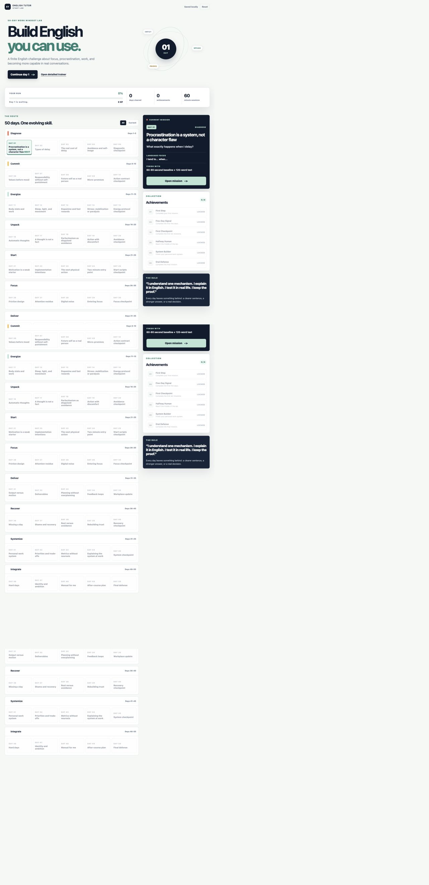
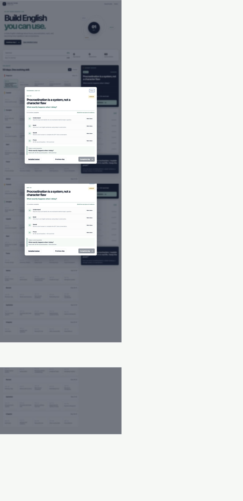
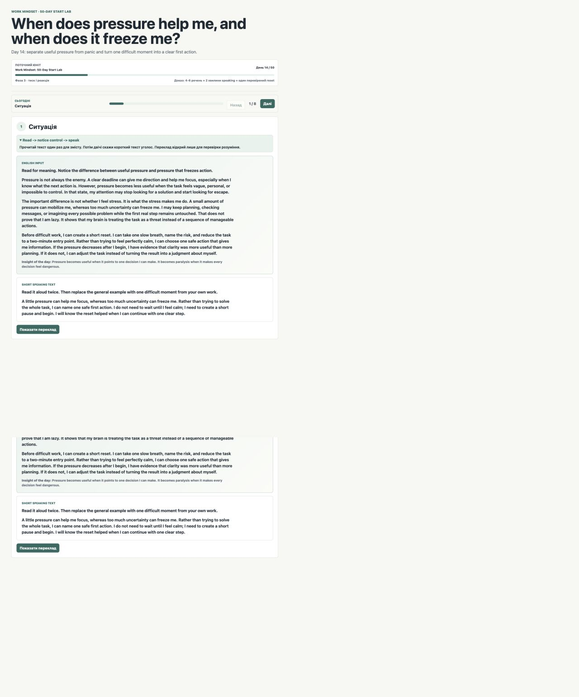

# English Tutor

An interactive English-learning system built around a practical goal: move from B1-ish spoken English to confident B2 communication for real conversations and AI/IT interviews.

The project is designed as a finite product, not an endless collection of lessons. It combines a 50-day learning route with a deeper writing and speaking trainer.

## The Problem

Traditional language study often creates a large amount of passive knowledge but very little usable speech. This project addresses that gap with a loop that connects:

- meaningful input;
- controlled sentence writing;
- reusable language constructions;
- adaptive speaking practice;
- evidence of completed work.

## What It Includes

### 50-Day Start Lab

The main interface is a progression-based challenge about focus, procrastination, work habits, and becoming more capable in real conversations.

- 50 connected days across 10 phases;
- one clear topic and finish condition per day;
- English learning content with Ukrainian support where comprehension needs it;
- progress, XP, achievements, and locked future days;
- local browser persistence with `localStorage`.

### Detailed English Trainer

The deeper trainer turns one daily topic into a complete lesson:

- an informative English input text;
- a full Ukrainian translation for comprehension checking;
- sentence-by-sentence breakdown;
- controlled Ukrainian-to-English reconstruction;
- hidden hints and iterative feedback;
- a finite phrase trainer with additional practice rows;
- a supported full-answer draft;
- a conversational GPT Voice prompt;
- evidence and repair phrases based on previous speaking mistakes.

## Learning Design

The product follows a simple progression:

```text
understand -> notice -> write -> revise -> speak -> reflect
```

The goal is not to produce a perfect model answer. The goal is to help the learner build several valid ways to express the same idea and then use those constructions in a live conversation.

## Product Flow







## Technical Structure

```text
index.html                 50-day challenge interface
app.js                     challenge state and progression logic
data.js                    finite 50-day content route
styles.css                 challenge UI
daily_task_app/             detailed lesson and writing trainer
docs/                       portfolio material and screenshots
```

The project is intentionally dependency-light. It runs as a static web application and stores progress locally in the browser. No learner journal, chat history, API key, or private profile data is included in this repository.

## Run Locally

From the repository root:

```bash
python3 -m http.server 8766
```

Open:

- `http://127.0.0.1:8766/index.html` for the 50-day challenge;
- `http://127.0.0.1:8766/daily_task_app/index.html` for the detailed trainer.

## Portfolio Material

- [Case study](docs/case-study.md)
- [Short presentation](docs/presentation.md)

## Status

This is a working personal learning product and a portfolio project. The core route, interactive challenge, writing trainer, feedback model, and speaking workflow are implemented. The next product layer is stronger session evidence and more adaptive content generation.

## Privacy

The repository contains anonymized product content only. Personal notes, journals, chat transcripts, local progress, and private English Tutor project instructions stay outside the public project bundle.
